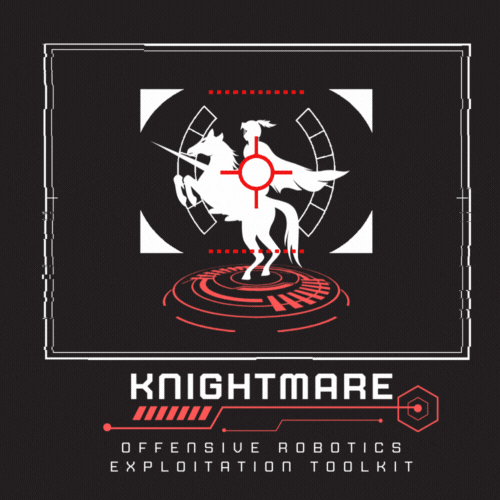

# Knightmare 
## Robotics Exploit Framework

<p align="center">
  
</p>

**Knightmare** is a modular, ICARUS-aligned exploitation framework for drones, robots, IoT, and RF systems. Designed for offensive and red-team applications, it runs on hardware like Raspberry Pi or Jetson Nano with attached tools like ESP32 Marauder, HackRF, or WiFi Pineapple.

---

## ✨ Features
- Interactive Metasploit-style CLI
- Modular YAML-based exploit modules
- ICARUS framework alignment (I, C, A, R, U, S pillars)
- Serial/USB device detection and communication
- Payload execution over UART (e.g. ESP32 commands)
- Activity logging

---

## 🚀 Getting Started

### 🔧 Requirements
```bash
python3 -m pip install -r requirements.txt
```

### 🔌 Connect Devices
Plug in an ESP32 Marauder or other UART-capable device. Knightmare will auto-detect serial ports.

### 🧠 Run Knightmare
```bash
python3 knightmare.py
```

### 🗒️ Example Session
```bash
knightmare> use esp32/scan_wifi
knightmare> connect /dev/ttyUSB0
knightmare> run scan_wifi
knightmare> log show
```

---

## 📦 Directory Structure
```
Knightmare/
├── modules/
│   └── esp32/
│       ├── scan_wifi.yaml
│       ├── deauth_attack.yaml
│       └── beacon_spam.yaml
├── logs/
│   └── knightmare.log
├── knightmare.py
├── requirements.txt
└── README.md
```

---

## 📚 ICARUS Pillars
| Pillar | Focus |
|--------|-------|
| **I** | Intelligence & Recon (e.g. WiFi scans) |
| **C** | Cyber TTPs (e.g. Deauth Attacks) |
| **A** | Aerial/Aquatic Disruption (e.g. GPS spoof) |
| **R** | Robot Hardening |
| **U** | Secure Operations |
| **S** | Monitoring/Response |

---

## ⚙️ Building a .deb (WIP)
```bash
#!/bin/bash
mkdir -p knightmare/usr/local/bin
cp knightmare.py knightmare/usr/local/bin/knightmare
fpm -s dir -t deb -n knightmare -v 0.1 knightmare/
```

---

## 💡 Credits
- Built by Lexie Thach (@Lexicon121)
- ESP32 Marauder by @justcallmekoko
- Inspired by Metasploit and ATT&CK

---

## 🛡️ Disclaimer
For educational and authorized security testing only.
